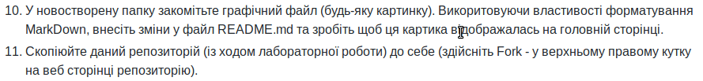

# Lab_1: Здобуття навиків роботи з системою версіонування коду GitHub.

1. Склоновано репозиторій командою `git clone <repo_url>`, де `<repo_url>` - посилання на репозиторій
2. Мій перший коміт
3. коміт `Мій перший коміт` має наступний хеш: `ab60fb5dfec4824d745d82755c84f0fc058be7c8`. Попередній коміт - `Initial commit` має хеш: `4efa8884c0d62392d8def407a058403bc4672160`. зміни відображаються корректно

4. Створив гілку `newb`, та перейшов на неї. Використав команди: `git branch newb` - для створення гілки та `git checkout newb` - для переходу на гілку. Зробив коміт

5. Перейшов на гілку master - зміни не присутні у файлі. Гілки створені для розгалудження процесів роботи з файлами. Гілки дозволяють створювати два незалежних так званих workflow (робочих процесів) які можна змінювати без впливу на інші такі самі workflow.
6. З'єднав гілки командою `git merge newb`
7. На мою думку конфлікт виник через те, що гіт не зміг самостійно з'єднати зміни у файлі README на гілці master та на гілці newb, тому виник конфлікт. Вирішив його вручну: відредагував файл.
8. Зробив папку ще на початку.
9. Зробив зміни у README через веб-версію. Зміни на локальній версії не відображаються. Потрібно синхронізувати віддалений репозиторій та локальний командою `git pull` - команда підтягує всі зміни з віддаленого репозиторію в локальний.
10. закомічено картинку:
- 
11. Зробив копію репозиторію до себе на аккаунт.
12. Склонував репозиторій на локальний пк та створив папку з прізвищем та файл, додав посилання.
13. Створив пул-реквест (пізніше, бо ше пару лаб тре зробити).