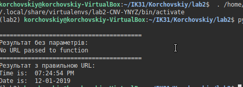
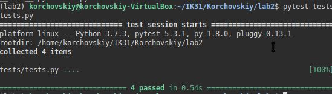

# Lab_2: Автоматизація. Знайомство з CI/CD.

1. Створив папку lab2 з README файлом.
2. Інсталював pipenv та створив середовище
3. Встановив бібліотеку requests та ntplib
4. створив файл `app.py`. скопіював код
5. Запустив програму:
- 
6. встановив бібліотеку `pytest`
7. Запустив тести:
- 
8. (ЗАХИСТ) - дописав функцію для перевірки часу доби
9. Написав тести для програми
10. Перенаправив результати виконання операторами `>` - створити та заповнити файл. `>>` - дописати в кінець файлу
11. Зробив коміт
12. дописав Makefile
13. зробив коміт
14. протестував роботу Makefile
