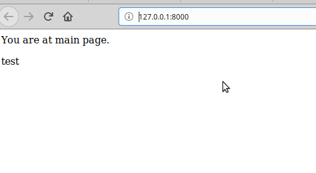

# Lab_3: Вступ до моніторингу.

1. створив папку лабораторної. ініціалізував середовище pipenv
2. створив заготовку. назвав "my_site". виніс файли на рівень вище
3. запустив сервер:
- 
4. зробив коміт. виключив файл db.sqlite3 з коміту через файл .gitignore
5. створив темплейт додатку (main)
6. створив папки та файли. зробив коміт
7. відредагував my_site/settings.py та додав `main` до `INSTALLED_APPS`.
8. відредагував файли html та json (main/views.py)
9. заповнив файли
10. запустив сервер:
- 
11. додав файл monitoring.py та встановив бібліотеку requests
12. все відображається
13. 