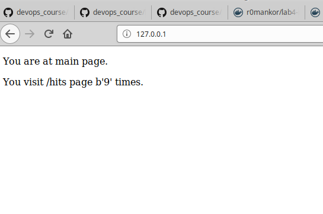
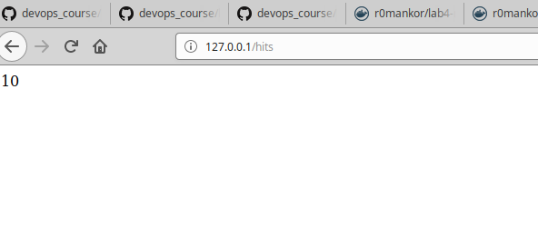
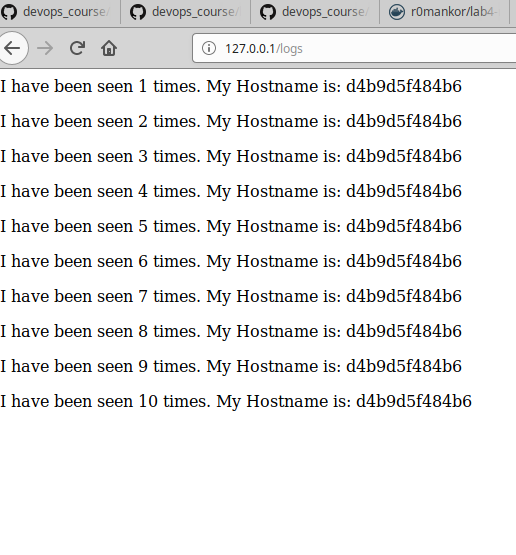

# Lab_5: Автоматизація за допомогою Makefile VS Docker Compose

1. OK
2. OK
3. Makefile - OK. docker-compose.yaml - OK
4. Makefile Method - OK.
5. Створив папку `my_app`. Створив папку `tests`. Скопіював файли з репозиторію до себе. Звернув увагу на файл `requirements.txt` - сказано файл буде містити залежності для нашого проекту, значить так воно і буде.
6. Спробуємо чи проект є працездатним:
```Bash
pipenv --python 3.7
pipenv install -r requirements.txt
pipenv run python app.py
```
- виконав стек команд вище для кожної папки: my_app та tests
- запустив тести. 3 з них пройшли успішно, а один - ні

7. видалив файли, що були створені після тестового запуску. Створив 2 докерфайли з вказаними іменами та Makefile.
8. Ознайомився з вмістом файлів. Директиви Makefile:
- зміннa STATES - зберігає назви цілей для побудови імеджів. Вона є розширюваною, а тому значення підставляються під час виконання.
- змінна REPO - містить назву репозиторію
- .PHONY = $(STATES) - вказує що цілі є фіктивними
- $(STATES):.... - створює імедж для вказаної цілі серед тих, що містяться у змінній STATES
- run:... - створення мережі та запуск контейнерів необхідних для сервера
- test-app - запуск контейнера з тестами
- docker-prune: ... - команди для очищення ресурсів докера
9. Створив імеджі використовуючи `make` зі своїми репозиторіями. Запустив тести та додаток. Скріни сторінок:
- 
- 
- 
10. Зупинив та почистив ресурси за допомогою `make docker-prune`
11. Створив директиву для завантаження імеджів у репозиторій та скористався нею. - `make docker-upload`
12. Видалив створені та закачані імеджі. Створив для цього директиву Makefile - `make prune-images`
13. Створив файл `docker-compose.yml` та заповнив його вмістом. Дві мережі: одна - публічна, друга - приватна. В межах приватної мережі контейнери комунікують та обмінюються цінними даними доступ до яких необхідно обмежити зовні.
14. Запустив `docker-compose -p lab5 up`
15. Сайт працює, адреса за якою необхідно перейти - 127.0.0.1:80
16. ДОкер створив імеджі з тегами: `bobas/lab4-examples:compose-app` та `bobas/lab4-examples:compose-tests`. змінив їх на власні та перезапустив компоуз.
17. зупинив. Почистив ресурси за допомогою `docker-compose down`
18. завантажив імеджі до хабу командою `docker-compose push`
19. Мені особисто ні тим ні тим не зручно користуватись, але думаю в рамках продакшена, для роботи з контейнерами краще використовувати docker-compose, а для всіх інших цілей підходить Makefile - тому, що він гнучкий і ним можна автоматизувати будь-яку задачу, а не тільки створення контейнерів.і
20. Створив окремий docker-compose.yml для своєї 4-ї лабораторної, виконав білд та завантажив імеджі. Файл помістив у відповідній папці.