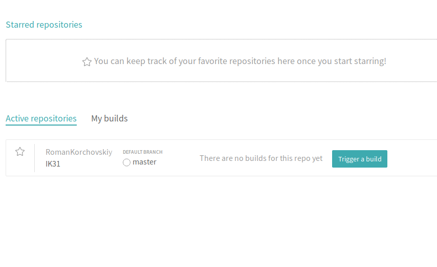

# Lab_6: Автоматизація за допомогою CI/CD серверів.

1. Прочитав про те, як налаштувати інтеграцію GitHub та Travis
2. Ознайомився з документацією Travis
3. Додав репозиторій до travis:
- 
4. Створив у своєму репозиторію `.travis.yml` та скопіював вміст.
5.  Ознайомився з документацією
6. Завдання:
- переписав білд lab2 з використанням кроків у Makefile
- переписав білд lab4
- переписав білд lab5
- посилання на білд травіс - https://travis-ci.org/RomanKorchovskiy/IK31

----------------------------
Edited to start travis build
